# 📱 Система тестирования

## 🔍 Описание проекта

Мобильное приложение **«Система тестирования»** создано для упрощения проверки знаний обучающихся путём автоматизации. Приложение позволяет:

- создавать курсы и тесты;
- автоматически подсчитывать результаты;
- анализировать статистику с гибкой фильтрацией.

### 📚 Актуальность

Автоматизация тестирования:

- снижает нагрузку на преподавателей;
- помогает оперативно контролировать знания;
- даёт учащимся обратную связь о пробелах.

## 🔐 Безопасность данных

- Пароли хешируются алгоритмом **Blowfish** (на сервере);
- Авторизационные данные на клиенте шифруются с помощью **AES-256**;
- Доступ регулируется **токенами** и **ролевой моделью**.

## 🖼️ Интерфейс

### Авторизация и регистрация

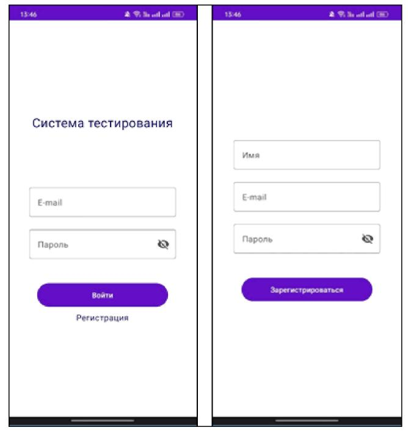

### Основные экраны системы

- Главный экран
- Экран тестов курса
- Экран участников курса

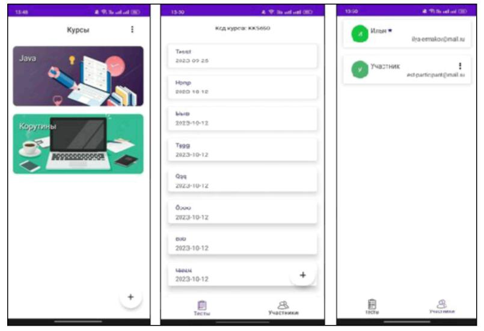

### Взаимодействие с тестами

- Добавление ответа
- Добавление вопроса
- Создание теста

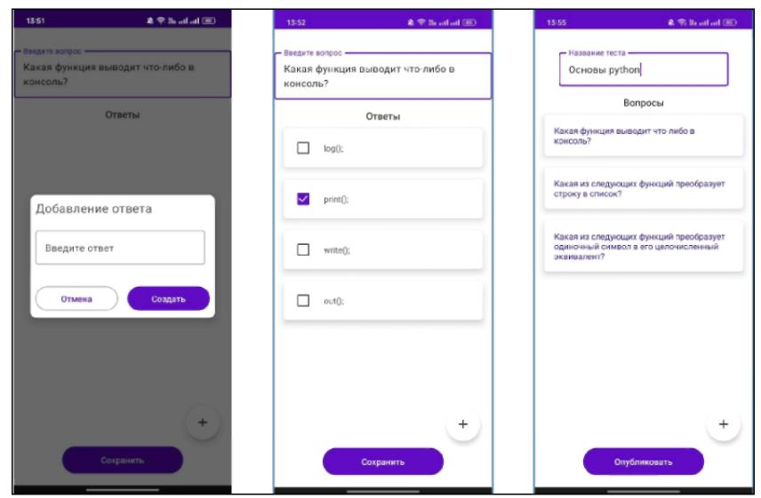

### Прохождение теста и просмотр результата

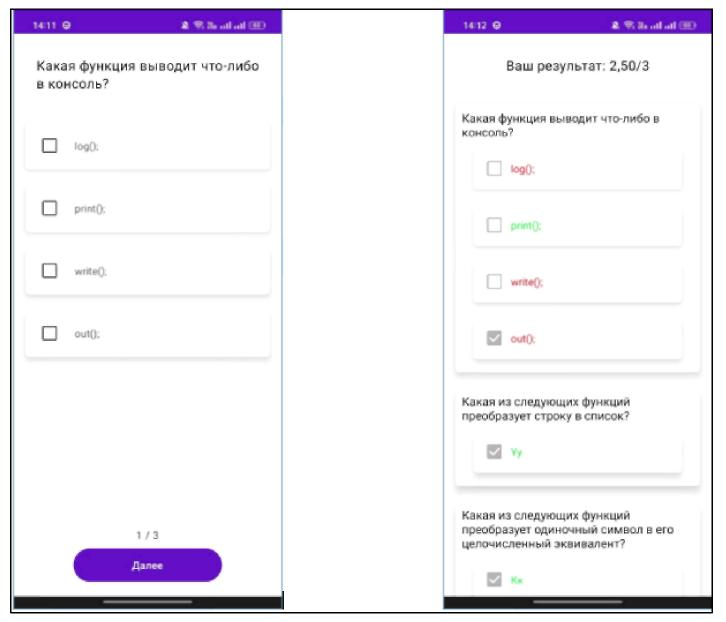

### Детальный просмотр результатов и фильтрация

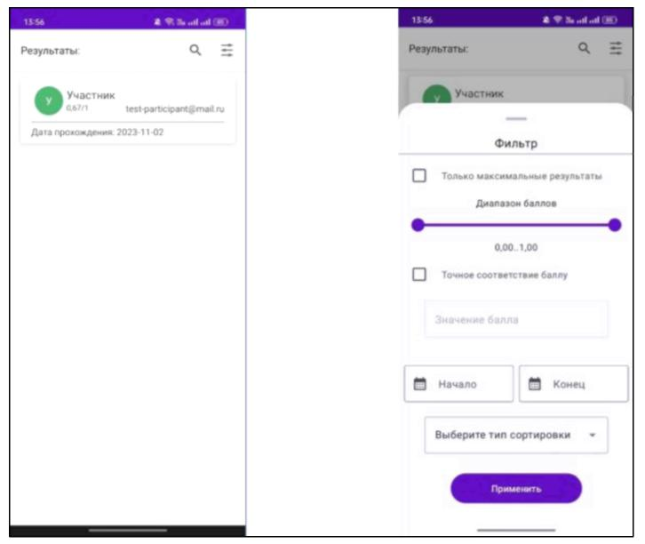

## 🛠️ Технологии

### Клиентская часть

- **Язык:** Kotlin 1.9.0
- **IDE:** Android Studio Iguana 2023.2.1
- **Фреймворк:** Jetpack Compose
- **Библиотеки:**
  - kotlinx.coroutines (1.7.1)
  - Hilt (2.46.1)
  - Retrofit (2.9.0)
  - Jetpack Security (1.1.0-alpha06)
  - MockK (1.12.7)
  - **God Of App States** (0.3.5)

### Серверная часть

- **Язык:** Python 3.8
- **IDE:** PyCharm 2023.2.5
- **Фреймворк:** FastAPI (0.74.1)
- **ORM:** SQLAlchemy (1.4.31)

## 🏛️ Архитектура приложения

### Архитектура сервера

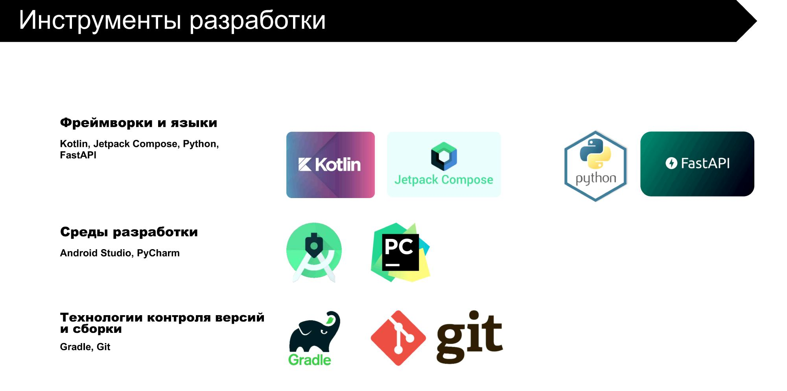

### Архитектура клиента

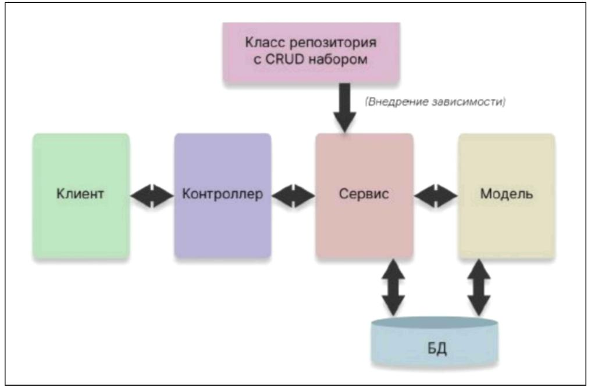

## 👥 Роли пользователей

- **Владелец курса:** управление тестами, участниками и модераторами
- **Модератор:** создание и удаление тестов, просмотр результатов
- **Участник:** прохождение тестов, просмотр результатов

## 🧭 Пути пользователя

- Просмотр списка курсов
- Список тестов (преподаватель)
- Список тестов (ученик)

## 🌳 Дерево функций

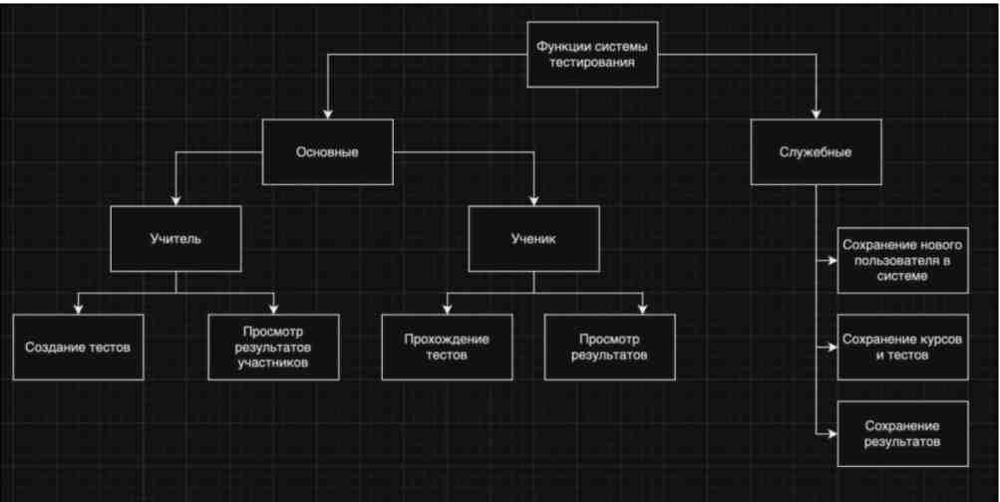

### Основные функции:

- Создание тестов
- Прохождение тестов
- Просмотр результатов (учителем и учеником)

### Вспомогательные функции:

- Сохранение пользователя
- Сохранение курсов и тестов
- Сохранение результатов

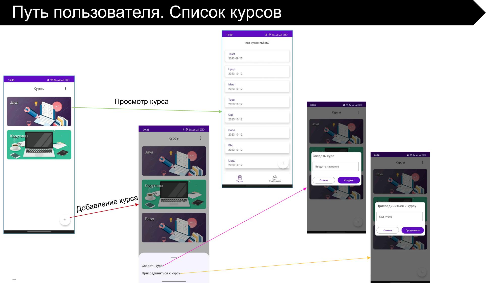
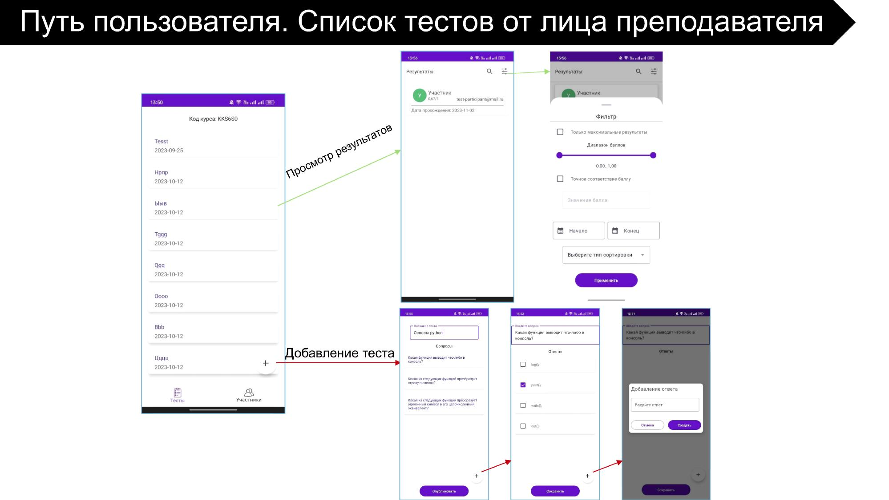
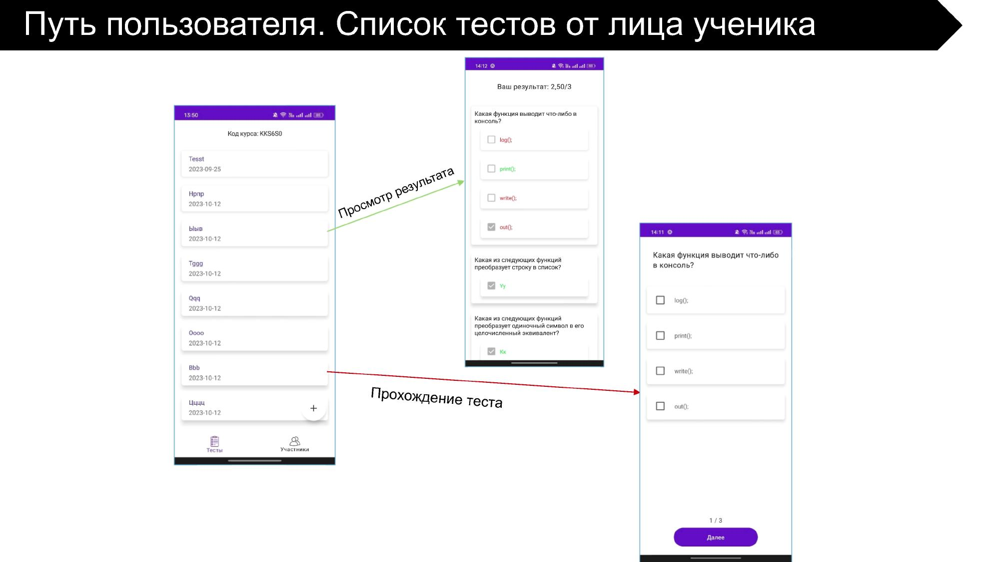
